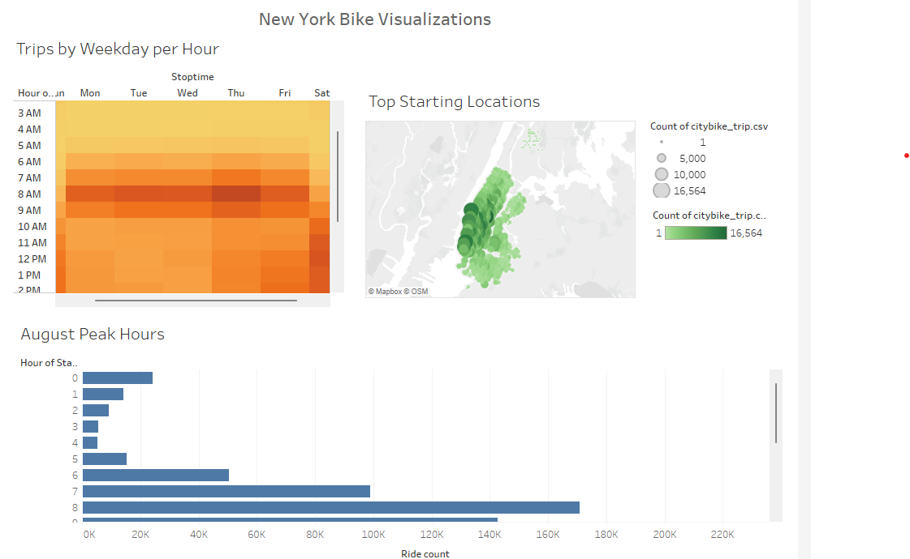
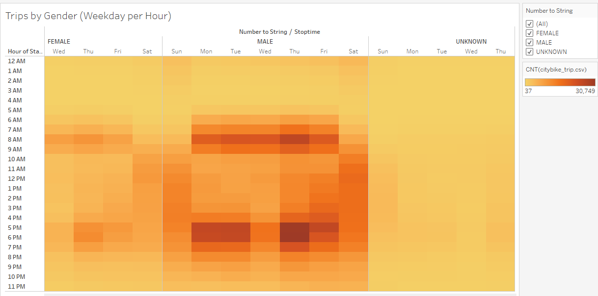

# bikesharing

[link to story](https://public.tableau.com/app/profile/tekeste.abraham.tewoldebrhan/viz/TripbyGender/NYCBikeStory?publish=yes)

# Overview of the analysis 
 To demonstrate bike-sharing program to investors using different visualization and the program is a solid business proposal in Des Moines, New York.  

# Purpose

- To create a line graph displaying the length of time that bikes are checked out for all riders and genders, and the graph can be filtered by hours and gender.
- To create a heatmap showing the number of bike trips for all riders and genders for each hour of each day of the week.
- To show the number of bike trips for each type of user and gender for each day of the week.
- To Create a story and report the final presentation. 

# Resources 

- Data: Citi Bike Data, 201908-citibike-tripdata.csv.zip
- Python (version 3.7.6) and Tableau Public (version 21.4.1440)

Results:- 
## Checkout Times for Users
   

The above graph shows that majority of the trips are taken within less tnan an hour in length. 

   

the graph can be filtered by hours and the trend shows that male riders take longer trips than female and known group.  

   

The above heatmap displays the number of bike trips by weekday per hour. In weekdays most bike users ride in the morning from 6-9a.m. and
4-7p.m in the afternoon. And weekend riders' bike from 7a.m to 8p.m. 

   

This heatmap clearly shows males are the dominant bike users compared to female and unknown users. 
Weekend rides are at highest level from 10a.m. to 7p.m.

   

This map is the user trips by gender be weekday. Subscribers are mostly males, and the customer users use bike during weekends. 
  
   

This bar graph demonstrates the pick hours for the month of August. The graph also tells the maintenance window for bike repair by hours. 

   

This shows the top starting locations for bike users in New York City. Big circles indicate the number of riders started the journey at those locations. 

# Summary
Based on the data from August 2019, males were the primary users of bike in New York City. Most users use bike for work and to home that covers 
from 6-9a.m. and 4-7p.m. It can conclude that biking is the most popular activity in New York city in summer and it is an alterbative transportation
method in the city. 

# Further Analysis: 
- Further data is necessary to see the difference and trend across the year, particularly for winter. 
- Add more data to describe the subscriber's address to know whether they are visitors or not. 
- Incorporate weather data to see the effect of weather on riders.  
